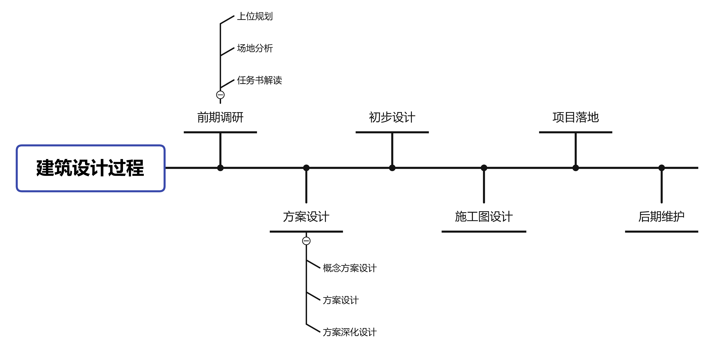
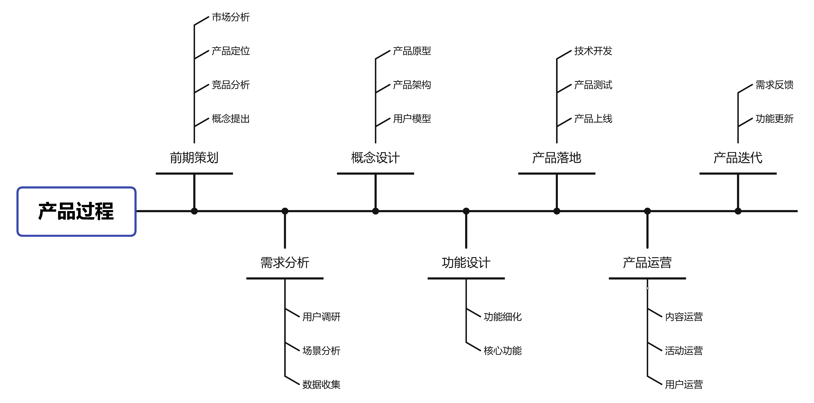

## 1. 前言

  2022年1月1日，建筑行业步入了过去十年最艰难的一年，同时也是未来十年最简单的一年。作为工作了三年的入门建筑师（也可能门也没入），在大环境愈发萧条的现实之下不得不对自己和行业进行一些思考。在这个背景下，我阅读了《人人都是产品经理》，查阅了大量有关产品经理的文章，发现建筑和产品经理是有许多共通之处的，建筑设计的过程的许多理念是可以引申到做产品的过程中去，同时产品经理的产品思维也是值得建筑师去学习的。

## 2. 建筑是什么

  建筑是容纳人类活动的构造物，也是人类活动发生的场所。建筑学研究的不仅仅是建筑物本身，更是研究人们对建筑物的要求以及需求如何得以满足。古罗马建筑家维特鲁威的《建筑十书》里写到，建筑的三要素为：坚固、实用、美观，这三要素到今天为止仍然是建筑师们遵循的基本准则。

## 3. 建筑师是什么

  建筑师通过与工程投资方和施工方的合作，在技术、经济、功能和造型上实现建筑物的营造。如同字面意思，建筑师是建筑的设计者，是对空间的二次构造。在建筑设计的过程中，建筑师往往扮演着统筹全局的角色，建筑师一方面对建筑整体的功能、造型和细节进行把控，另一方面对结构、水电和暖通等各专业进行总体协调，确保建筑的顺利落地。因此，建筑师对建筑本身负责，同时甲方对设计进行评价和反馈，建筑师针对需求和意见进行修改和优化，这便是建筑师的工作内容。

## 4. 产品是什么

  百度百科上写到：产品是指人们使用和消费，并能满足人们某种需求的任何东西，包括有形的物品、无形的服务、组织和观念或者他们的组合。从这里可以看出，产品有两个重要的元素：用户和需求。产品本质上是一种需求解决方案，它的价值是由用户去衡量的。

## 5. 产品经理是什么

  如同建筑师不仅仅只是设计建筑，产品经理也不只是设计产品，还需要对产品的需求捕获和分析，开发和落地，优化和迭代，运营和维护。从这个层面上看，建筑师和产品经理是有共通之处的。但是产品经理的职责描述分歧很多，在不同的行业、公司所承担的角色也相差很大，因此很难去定义产品经理到底是什么，但是有一点是确定的，产品经理是为用户服务的，负责产品的整个生命周期。

## 6. 建筑与产品的同与异

  建筑是满足人们生活需求场所，从本质上看它就是一种产品，针对不同的活动场景，建筑的类型也纷繁复杂。接下来对建筑和产品进行简单的分类。

### 6.1 需求的共性

建筑分类

| **需求种类** | **建筑种类** |
| :----------: | :----------: |
|     居住     |   住宅建筑   |
|     消费     |   商业建筑   |
|     艺术     |   展览建筑   |
|     生产     |   工业建筑   |
|     ...      |     ...      |

产品分类

| **需求种类** | **产品种类** |
| :----------: | :----------: |
|     交流     |   社交产品   |
|     消费     |   购物产品   |
|     娱乐     |  音视频产品  |
|     游戏     |   游戏产品   |
|     ...      |     ...      |

由此可以看出，需求是决定建筑 or 产品种类的因素之一，两者在本质上是共通的，建筑 or 产品的存在价值就是满足需求。

### 6.2 设计过程的共性

- 建筑的设计过程可以概括为：

  

- 产品的设计过程可以概括为：

  大概的说，两者都可以总结为：

  **前期调研分析——概念设计——落地设计——后期维护**

- 二者都是以某一个”东西“作为研究对象，去解决某些具体的问题的角色
- 二者都是以别人为中心，即“同理心”。
- 前期分析中，建筑的设计需要从环境和事件场景出发，提出建筑的城市定位和目标人群（在城市扮演什么角色，给人类带来了什么空间），这与产品的思考逻辑是一致的。
- 住宅/商业建筑的设计，也需要对周边环境里的竞品进行分析，找准自身的定位，打造特色亮点，才能在众多同质化的建筑中脱颖而出，产品本身也是如此。
- 建筑设计的过程里，对内经常需要和结构、水电、暖通等相关专业进行充分的沟通，对外需要和甲方、政府（旧改类项目还需要和原住民）进行沟通交流，在产品的设计过程里，产品经理也需要同技术、运营、设计沟通交流，从这个角度看，建筑和产品都不是一个角色可以完成的，而是需要充分发挥团队的力量。

### 6.3 建筑与产品的差异

- **建筑是0→1，产品是0→1→n**

  - 建筑从设计到落成后，其功能基本上已经固定，即使是进行改造和扩建，其辐射的空间范围也是有限的。

  - 产品诞生后，通过迭代更新可以实现更多的功能，从而吸引更多的用户，其影响力和对生活方式的改变是不可估量的（如微信从基本的社交工具到现在的微信支付、微信小程序）。
- **建筑同质化程度相比产品较低**
  - 建筑因用地条件和地方规范不一样，即是是同一个地产的建筑也难以完全一致，而高度标准化的产品基本上是针对B端客户而言的（某桂园，某大等等）。
  - 不同公司产品针对相同的用户，产品的功能可以是几乎一致的（搜索引擎，外卖平台，直播平台等等）。
- **建筑和产品的生命周期不同**
    - 建筑是有使用年限的，其生命周期是有限的，结局一般是改造、维护或拆除（纪念性建筑因其社会形象和精神支撑的作用，往往是维护）。
    - 一个产品，如果不断地针对用户的需求进行更新和迭代，其生命可以是无限的。
- **建筑的监管和规范和产品不同**
    - 因为建筑本身与安全和社会问题息息相关，因此在设计的过程中涉及到的相关部门十分之多（如消防部门、规划部门、教育部门、交通部门等等），这导致了建筑更多向着政府层面倾斜。
    - 产品受到的监管政策则与其本身的类型有关，因此产品更多还是以用户需求为中心的。
- **建筑的项目周期往往比产品长**
    - 一个建筑从拿地到设计到落成到用户反馈，往往需要2-5年的时间，受到的制约因素太多。
    - 在底层技术和互联网环境稳定的情况下，一个产品往往几个月就可以就可以诞生。
- **建筑可以脱离实际功能存在**
    - 建筑由于其本身具有艺术上的价值体现，一栋建筑可以没有任何使用功能，它可以是精神需求的载体（如纪念性建筑），而产品是否可以脱离功能而独立存在，我认为是不成立的。

## 7. 建筑师的产品能力

- 不断学习，终身学习，这是两个职业都必须具备的能力。
- 建筑也是一门讲逻辑的专业，而产品的逻辑恰恰是建筑师所需要的。
- 建筑本身就是产品，建筑师也需要培养自身的产品思维，利用产品的工具去实现建筑更合理的设计流程。
- 建筑设计同产品一样没有唯一的解决方案，都是在诸多问题里寻找更优解。针对问题第一步是“搞清楚问题，再选择方法”，而不是直接去设法解决。
- 用心听，但不要照着做，这是苏杰在《人人都是产品经理》里提到的一句话，建筑师也同样如此，要理解客户需求背后的核心理由，而不是跟随表面的要求去进行设计，这在甲方的沟通交流中尤为常见，建筑师需要去发掘甲方提出的要求的逻辑是什么，提高自身思考的能力。
